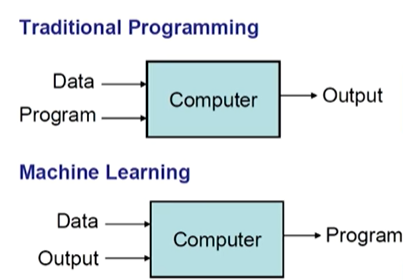

# Chapter 1.1: Computational Thinking

## What is Machine Learning?
### Definition
> "The field of study that gives computers the ability to learn without being explicitly programmed." — **Arthur Samuel (1959)**

 

### Traditional Programming vs Machine Learning

  

In ***Traditional Programming***, a programmer would:
1. Explicitly write a program for the computer to execute.
2. Data is input into that program.
3. The program produces an appropriate output based on the input data.

In ***Machine Learning*** however:
1. Expected output is provided to the computer.   
**(Examples of what the program should do, labels, or characterizations of different classes of things)**
2. Input data is also provided.
3. The machine learning algorithm produces a "program" that can then be used to infer new information or make predictions about unseen data.

 

### How does a Machine Learning Algorithm learns?
* **Learning from experience**: The goal is to have a program that can learn from experience and use that knowledge to deduce new facts.
* **Learning without explicit programming**: Machine learning is defined as "the field of study that gives computers the ability to learn without being explicitly programmed."
* **Inferring implicit patterns from data**: Instead of having patterns explicitly built into the program, the algorithm figures out what those patterns are from the data itself.
* **Producing a program from data and desired output**: Unlike traditional programming where a program takes data to produce output, in machine learning, you provide the expected output (e.g., labels, examples) and data, and the algorithm then produces a program that can make [inferences](# "An inference is a logical conclusion or deduction reached based on evidence, reasoning, and prior knowledge rather than direct observation.").
* **Using training data to build an inference engine**: The system is given training data (observations), and it tried to figure out how to write a program that will infer something about the process that generated that data. This inferred model can then be used to make predictions about unseen data.

 

### Examples of Machine Learning Applications

  

1. **AlphaGo**: A machine learning system from Google that beat a world-class Go player. He also notes that chess was conquered by computers earlier, and now Go belongs to computers.
2. **Recommendation Systems**: Systems like Netflix, Amazon, and Google ads use machine learning algorithms to suggest items or display ads based on user preferences.
3. **Drug Discovery**: Machine learning is used in the process of discovering new drugs.
4. **Character Recognition**: The post office uses machine learning algorithms for character recognition of handwritten text.
5. **Two Sigma Hedge Fund**: An MIT spin-off company that heavily uses AI and machine learning techniques in its operations, achieving impressive returns.
6. **Siri**: Apple's virtual assistant uses machine learning.
7. **Mobileye**: Another MIT company that develops computer vision systems with a strong machine learning component, used in assisted driving and autonomous driving for features like automatic braking.
8. **Face Recognition**: Facebook and many other systems use machine learning for detecting and recognizing faces.
9. **IBM Watson for Cancer Diagnosis**: IBM Watson uses machine learning, specifically deep learning and natural language processing (NLP), to assist in cancer diagnosis and treatment by analyzing massive, unstructured datasets, including medical records, scientific literature, and genomic data.

 

---
 

### 🔴 This marks the end of Chapter 1.1 of the Microsoft ML for Beginners Course. 🔴
Chapter 1.2 will discuss about **Unlabelled Data and Labelled Data**.