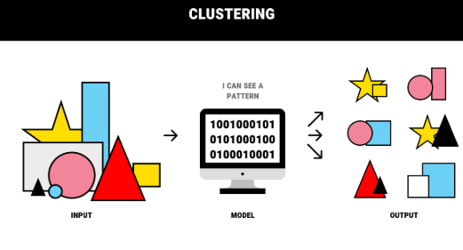
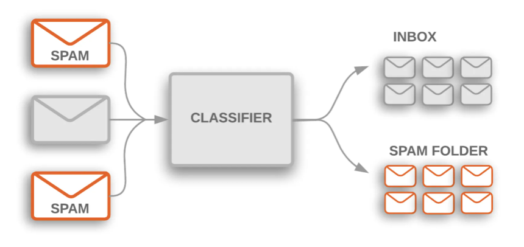
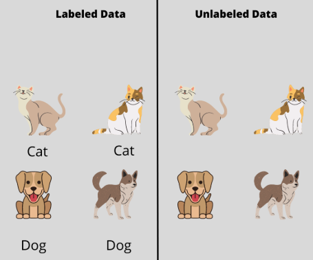

# Chapter 1.2: Unlabeled Data and Labeled Data

Certain educational assets featured herein are provided courtesy of the MIT OpenCourseWare course, **6.0002 Introduction to Computational Thinking and Data Science**, Fall 2016, by Prof. Eric Grimson, Prof. John Guttag, and Dr. Ana Bell.

---

### Unlabeled Data
Unlabeled data is raw, unprocessed data without any additional tags or [classifications](# "Classification in machine learning is a supervised learning approach that categorizes data into predefined labels or classes based on training from labeled datasets."). 
Unlabeled data is abundant and easy to collect at scale (e.g., vast amounts of images from the internet, web scrapes, log files).
 
 
* **Usage**: Primarily used in [unsupervised learning](# "Unsupervised learning is a type of machine learning that analyzes and clusters unlabeled datasets to discover hidden patterns, structures, or relationships without human intervention."), where algorithm explore the data to find inherent patterns, structures, or groupings on their own without prior guidance. 

* **Examples**:
    1. A collection of photos with no descriptions.
    2. Customer transaction data without any fraud indicatiors.
    3. A large body of text documents with no topic or category assigned.
* **Acquisition**: Readily available and generally inexpensive to acquire, but extracting actionable insights from it requires more sophisticated algorithms. 

* **Benefits**: Useful for exploratory data analysis, dimensionality reduction, and [clustering](# "Clustering is an unsupervised machine learning technique that automatically groups similar, unlabeled data points into clusters based on shared features.") tasks, helping to uncover hidden insights or new data categories that might not be immediately obvious.

 

  

 

---

### Labelled Data
Labeled data consists of raw data points augmented with meaningful tags, labels, or classes, which serve as the "correct answer" or ground truth for a machine learning model.
 
* **Usage**: Primarily used in [supervised learning](# "Supervised learning is a type of machine learning where algorithms are trained using labeled datasets, meaning input data is paired with the correct output."), where an algorithm learns the relationship between the input data (features) and the output labels, allowing it to make predictions on new, unseen data. 

* **Examples**:
    1. Images of animals tagged as "cat" or "dog".
    2. Emails marked as "spam" or "not spam".
    3. Customer reviews classified by sentiment (positive, negative, or neutral).
* **Acquisition**: Requires human annotators or domain experts to manually label each data point, which is a time-consuming and expensive process. 

* **Benefits**: Enables highly accurate and precise models for specific tasks like [classifications](# "Classification in machine learning is a supervised learning approach that categorizes data into predefined labels or classes based on training from labeled datasets.") and [regression](# "Regression in machine learning is a type of supervised learning used to predict continuous numerical outcomes (e.g., prices, temperature, sales) by modelling the relationship between input features and a target variable."), as the model has explicit guidance during training.

 

  

 

---

### Labeled vs Unlabeled Data

| Feature | Labeled Data | Unlabeled Data |
| --- | --- | --- |
| **Definition** | Data with input features and corresponding output labels ("ground truth"). | Data with only input features and no output labels. |
| **Learning Type** | Used in supervised learning. | Used in unsupervised learning. |
| **Goal** | Train models to predict specific labels or values. | Discover patterns, structures, and groupings within the data. |
| **Acquisition** | Expensive and time-consuming to obtain, requiring human annotation. | Cheap and easy to collect at scale (raw data). |
| **Accuracy** | Generally leads to more accurate, task-specific models. | Results can be more subjective or exploratory. |

 

  

 

---

### 🔴 This marks the end of Chapter 1.2 of the Microsoft ML for Beginners Course. 🔴
Chapter 1.3 will discuss about **Supervised Learning and Unsupervised Learning**.