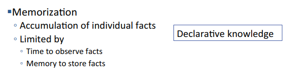
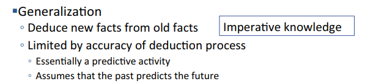
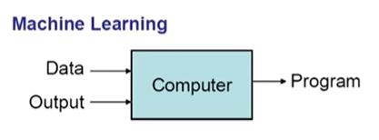
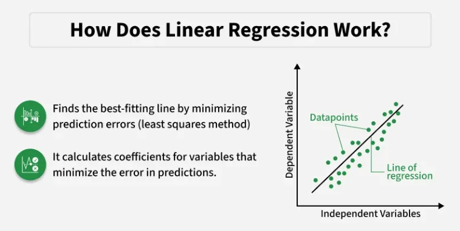

# Chapter 1.3: Supervised and Unsupervised Learning

This chapter covers in-depth theoretical understanding about supervised and unsupervised learning for Machine Learning Algorithms.

Drawing from the curriculum developed by **Prof. Eric Grimson**, **Prof. John Guttag**, and **Dr. Ana Bell** at the **Massachusetts Institute of Technology (MIT)**, it explores the mathematical frameworks and algorithmic logic that underpin modern machine learning.

Certain educational assets featured herein are provided courtesy of the MIT OpenCourseWare course, 6.0002 Introduction to Computational Thinking and Data Science, Fall 2016, by Prof. Eric Grimson, Prof. John Guttag, and Dr. Ana Bell.

**Objective**: Understand how data patterns are identified and utilized for predictive modeling.

---

### 1. How Humans Learn
Before examining the mechanics of machine learning, it is essential to recognize that these computational frameworks are fundamentally rooted in human cognitive processes. By understanding the parallels between biological learning and algorithmic derivation, we can better appreciate how machines replicate human-like pattern recognition and decision-making.

 

  

* **Memorizing Facts**: This learning technique involves accumulation of individual facts, where one memorizes as many facts as possible. This is akin to ***declarative knowledge** (statement of truth)

 

  

* **Inferring/Deducing new information**: A better way to learn is to be able to infer or deduce new information from existing knowledge. This relates to ***imperative knowledge***, which involves ways to deduce new things.

 

### 2. How Machine Learning Algorithm Learns

> "The field of study that gives computers the ability to learn without being explicitly programmed." — **Arthur Samuel (1959)**

Art Samuel wrote a checkers program that learned how to improve by watching its performance and inferring changes.
(Art Samuel also invented [Alpha-Beta Pruning](# "Alpha-beta pruning is an optimization technique for the minimax algorithm that reduces the number of nodes evaluated in a game tree, significantly improving efficiency without affecting the final decision."), which is a very useful technique for doing search.)

 

  

* A Machine Learning Algorithm (ML Model) learns by the computer **receiving training data** and **outputs (labeled examples, data characterizations)**, and the algorithm then produces a **"program"** that can be used to infer new information.

 

  

* **Linear Regression (The curve-fitting algorithm)** trains a model by finding the best-fitting straight line through data points, using **supervised learning** to minimized the error between predicted and actual values. Iteratively adjusting the slope and intercept *(weights)* using methods like **Ordinary Least Squares (OLS)** or **Gradient Descent** to minimize the sum of squared differences, resulting in a predictive model.

 

---

### Basic Paradigm
The basic paradigm involves:
1. Providing training data (observations)
2. An inference engine then figures out how to write a program/system that infers something about the process that generated the data.
3. This learned program is then used to make predictions about unseen things

The learning process often involves **finding implicit patterns in the data**, rather than explicitly built-in comparisons, and then using these patterns to generate a program for inference.

 

### Variations on paradigm
* **Supervised**: given a set of feature/label parts, find a rule that predicts the label associated with a previously unseen input.
* **Unsupervised**: given a set of feature vectors (without labels) group them into "natural clusters" (or create labels for groups)

 

---

### Supervised Learning

***[Supervised Learning - AI Basics]***

Supervised learning is a type of machine learning where algorithms are **trained using labeled datasets**, meaning input data is paired with the correct output.

By mapping inputs to known outputs, the model learns to identify patterns, make predictions, and classify data on new, unseen information. It is widely used for classification and regression tasks.

 

* Key Aspects of Supervised Learning:

    * **Labeled Data**: The training data includes both input features and the corresponding target answers.
    * **Process**: The model makes predictions on the training data and corrects itself based on errors, adjusting parameters until it achieves high accuracy.
    * **Goal**:  To generalize from training data to accurately predict outcomes for new data.

 

* Common Algorithms for Supervised Learning:
    * **Classification**: Predicts categorical labels (e.g., spam/not-spam, disease detection). Common algorithms include Random Forests, Support Vector Machines (SVM), and Neural Networks.
    * **Regression**:  Predicts continuous numerical values (e.g., house prices, stock trends). Common algorithms include Linear Regression and Polynomial Regression.

 

* Real-World Applications:
    * **Medical Imaging**: Identifying abnormalities in X-rays.
    * **Fraud Detection**: Identifying fraudulent financial transactions.
    * **Spam Filters**: Recognizing unwanted emails.

 

---

### Unsupervised Learning

***[Unsupervised Learning - AI Basics]***

Unsupervised learning is a type of machine learning that **analyzes and clusters unlabeled datasets** to discover hidden patterns, structures, or relationships without human intervention.

Ideal for exploratory data analysis, customer segmentation, and anomaly detection.

 

* Key Aspects of Supervised Learning:
    * **Unlabeled Data**: The algorithm is provided with raw data (x) and no corresponding output (y).
    * **Goal**: To model the underlying structure or distribution in the data to learn more about it.

 

* Techniques:
    * **Clustering**: Grouping similar data points together (e.g., K-Means, Hierarchical clustering)
    * **Dimensionality Reduction**: Reducing the number of random variables under consideration to simplify data (e.g., PCA, Autoencoders).
    * **Association Rule Learning**: Finding rules that describe large portions of the data.

 

* Real-World Application:
    * **Customer Segmentation**: Clustering customers based on purchasing behaviour without prior knowledge of segmentation types.
    * **Fraud Detection**
    * **Recommendation Engines**
    * **Data Preprocessing**
    
 

---

### Semi-supervised Learning
Semi-supervised learning is a hybrid machine learning approach that trains models using a small amount of labeled data paired with a large volume of unlabeled data.   

It bridges the gap between supervised and unsupervised learning, significantly reducing data annotation costs while improving model accuracy and generalization. 

While semi-supervised learning is out of the scope of this course, it is important to know that this learning method exists.

---
 

### 🔴 This marks the end of Chapter 1.3 of the Microsoft ML for Beginners Course. 🔴
Chapter 1.4 will discuss about **Feature Engineering**.