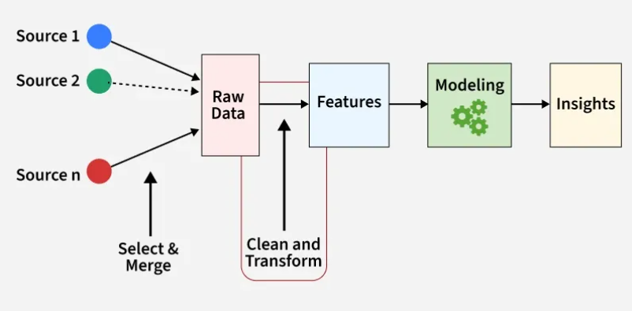
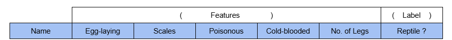
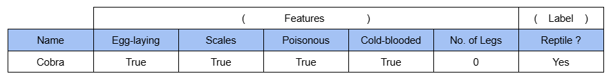
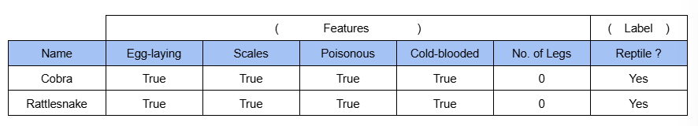
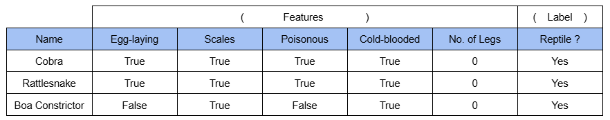
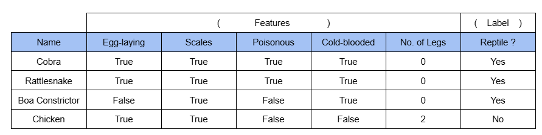
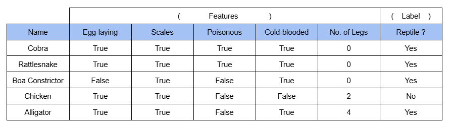
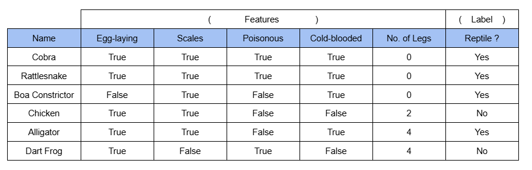
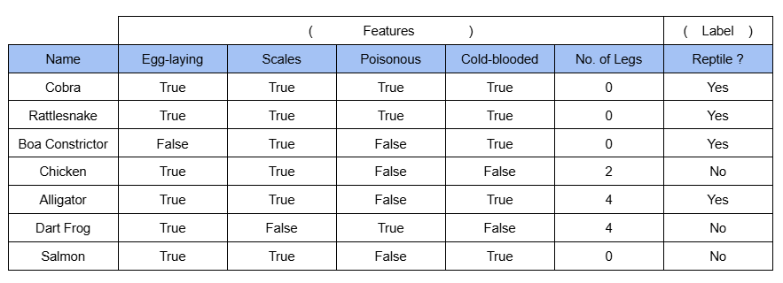
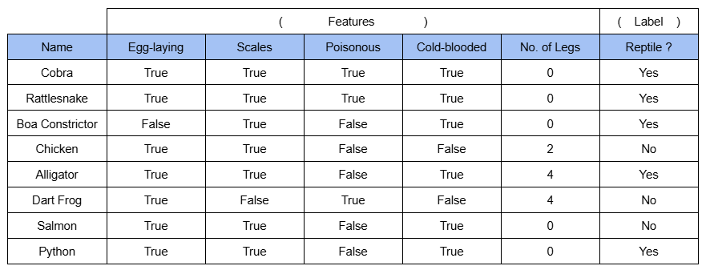

# Chapter 1.4: Feature Engineering

Certain educational assets featured herein are provided courtesy of the MIT OpenCourseWare course, 6.0002 Introduction to Computational Thinking and Data Science, Fall 2016, by Prof. Eric Grimson, Prof. John Guttag, and Dr. Ana Bell.

 

---

**Feature engineering** is one of the crucial aspects of machine learning.

 

Before you can effectively **cluster** (unsupervised learning), and **classify** (supervised learning) data, it is essential to conduct *feature engineering* to **transform them into more informative inputs** for a predictive model.

 

1. **Cluster-Based Feature Extraction**
    * Involves clustering groups "nearby points" in unlabeled data.
    * In feature engineering, these resulting cluster IDs can be added as a new categorical feature to a dataset.
    * This helps a supervised model to capture complex, non-linear structures that might not be obvious from individual raw features.

2. **Dimensionality Reduction**
    * Clustering simplifies complex data by replacing multiple raw features with a single cluster label.
    * This "compression" is a form of feature engineering that reduces noise and helps models focus on significant data patterns.

3. **Generating "Pseudo-Labels"**
    * Clusters can "assign labels to new data"".
    * This is used in semi-supervised learning to engineer features for unlabeled datasets by using a small amount of labeled data to "propagate" categories to similar, unlabeled groups.

4. **Handling Class Imbalance and Error Trade-offs**
    * Make decisions with respect to trading off **"false positives""** versus **"false negatives"**.
    * Feature engineering addresses this by creating features that specifically highlight minority classes or help a classifier better "separate labeled groups" to minimize these specific errors.

5. **Preventing Overfitting**
    * It may not be possible to "perfectly separate groups without [overfitting](# "Overfitting (caused by having too many parameters) in machine learning occurs when a model learns training data too closely, memorizing noise and specific, non-generalizable patterns rather than the underlying trend. Resulting in high accuracy on training data but poor performance on unseen, real-world data.")".
    * Proper feature engineering, such as **feature selection** (removing redundant data), is critical to creating simpler, more robust models that generalize better to new data.

 

---

### Feature Engineering

 

***[Feature Engineering Architecture]***

  

Features never fully describe the situation.
> "All models are wrong, but some are wrong, but some are useful." **— George Box**

 

Feature engineering involves representing examples by **feature vectors** that will facilitate generalization.

 

Suppose you want to use 100 examples from the past to predict, at the start of the subject, which students will get an A in a course.
* Some features are helpful, e.g., GPA, prior programming experience.
* Others might cause the model to overfit. Data like student birth month, eye color.

 

Feature engineering suggests that we need to think about **how to pick the features** for a ML model, and maximize **Signal-to-Noise Ratio (SNR)**.
* Maximimize features that carry the most information, and remove the ones that don't.

 

---

### Given an Example

(Note that this example is used in relevance to **Chapter 1.5: Minkowski Metric**)

 

Example: You are classifying reptiles given a set of animal data (features).

  

 

**Animal 1**: 
* Animal: Cobra
* Features: Lay eggs, has scales, is poisonous, is cold-blooded, and no legs.
* Label: Reptile

  

Initial Model: Not enough information to generalize.

 

**Animal 2**:
* Animal: Rattlesnake
* Features: Lay eggs, has scales, is poisonous, is cold-blooded, and no legs.
* Label: Reptile

  

Initial Model:
1. Egg-laying
2. Has Scales
3. Poisonous
4. Cold-blooded
5. No legs

These are the current set of rules or features the ML model currently uses to classify an animal as a Reptile. Which can be refined with more animal data.

 

**Animal 3**:
* Animal: Boa Constrictor
* Features: Does not lay eggs, has scales, is not poisonous, is cold-blooded, and no legs.
* Label: Reptile

  

Boa doesn't fit model, but is labeled as a reptile, model is refined.

Current Model:
1. Has scales
2. Cold-blooded
3. No legs

 

**Animal 4**:
* Animal: Chicken
* Features: Lay eggs, has scales, is not poisonous, is not cold-blooded, and has 2 legs.
* Label: Not Reptile.

  

Current Model:
1. Has scales
2. Cold-blooded
3. No legs

 

**Animal 5**:
* Animal: Alligator
* Features: Lay eggs, has scales, is not poisonous, is cold-blooded, and has 4 legs.
* Label: Reptile.

  

Alligator doesn't fit model, but is labeled as a reptile. Model needs to be refined.

Current Model:
1. Has scales
2. Cold-blooded
3. Has 0 or 4 legs

 

**Animal 6**:
* Animal: Dart frog
* Features: Lay eggs, does not have scales, is poisonous, is not cold-blooded, and has 4 legs.
* Label: Not Reptile.

  

Current Model:
1. Has scales
2. Cold-blooded
3. Has 0 or 4 legs

 

**Animal 7**
* Animal: Salmon
* Features: Lay eggs, has scales, is not poisonous, is cold-blooded, and has 0 legs.
* Label: Not Reptile.

  

Current Model:
1. Has scales
2. Cold-blooded
3. Has 0 or 4 legs

 

**Animal 8**
* Animal: Python
* Features: Lay eggs, has scales, is not poisonous, is cold-blooded, and has 0 legs.
* Label: Reptile.

  

Current Model:
1. Has scales
2. Cold-blooded
3. Has 0 or 4 legs

 

#### These animal data has built a ML model that classifies any animals that has scales, is cold-blooded, and has 0 or 4 legs to be a Reptile.

#### But the best thing to do is to go back to just TWO(2) features: scales and cold-blooded. If an animal has neither of this trait, the ML model will classify that animal to not be a Reptile.

#### It won't be perfect. As following these features will incorrectly label the Salmon as a reptile. But the **design choice** being made here is important.

#### Following this design choice, the ML model will have no *false negatives*. That means there will not be any instance of something that is a reptile that the ML model is going to label as not a reptile.

#### There may be some *false positives*. Like labelling Salmon as a reptile.

#### This trade-off between *false positives* and *false negatives* is something that we should worry and think about, as there is no perfect way, in many cases, to separate the data.

#### You must be willing to decide how many false positives or false negatives do you want to tolerate.

 

### After figuring out what features to use (feature engineering), the next step is to decide about the distance.
* **How to compare two feature vectors?** (we use vectors as the unit due to having multiple dimensions to features)
* **How to decide to compare these features?**
* **How to then use distances to figure out how to group things together, or how to find a dividing line that separate things apart?**
* **How to weigh relative importance of different dimensions in the feature vector?**

These will be covered in **Chapter 1.5: Minkowski Metric**

 

---

### 🔴 This marks the end of Chapter 1.4 of the Microsoft ML for Beginners Course. 🔴
Chapter 1.5 will discuss about **Minkowski Metric and Distance**.