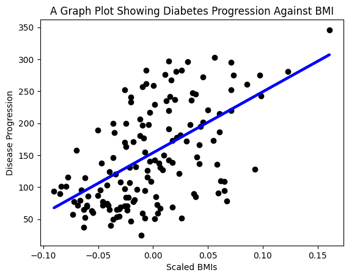

# Disease Progression Prediction based on BMI with Linear Regression

For this linear regression project, we're going to use the built in Scikit-Learn diabetes dataset.

Link to the dataset: https://scikit-learn.org/stable/datasets/toy_dataset.html#diabetes-dataset

<br>

---

### Dataset Characteristics

Ten baseline variables, age, sex, bmi, average blood pressure, and six blood serum measurements were obtained for each n = 442 diabetes patients, as well as the response of interest, a quantitative measure of disease progression one year after baseline.

This dataset includes 442 samples of data around diabetes, with 10 feature variables:

1. **Number of Instances**: 442

2. **Number of Attributes**: First 10 columns are numeric predictive values

3. **Target**: Column 11 is a quantitative measure of disease progression one year after baseline.

4. **Attribute Information**:
    * age (in years)
    * bmi (body mass index)
    * bp (average blood pressure)
    * s1 tc (total serum cholestrol)
    * s2 ldl (low-density lipoproteins)
    * s3 hdl (high-density lipoproteins)
    * s4 tch (total cholestrol / HDL)
    * s5 ltg (possibly log of serum triglycerides level)
    * s6 glu (blood sugar levels)
    * y (disease progression scores)

<br>

Source URL: https://www4.stat.ncsu.edu/~boos/var.select/diabetes.html

Dataset: https://www4.stat.ncsu.edu/~boos/var.select/diabetes.tab.txt

NOTE 1: Each of these 10 feature variables have been mean centered and scaled by the standard deviation times the square root of `n_samples` (i.e. the sum of squares of each column totals 1).

NOTE 2: This dataset is a "toy" dataset, it means the creators of Scikit-Learn have already packaged this data directly inside the library. You don't need to download a CSV file, format an Excel sheet, or copy-paste the table of data. You can simply use Python to fetch it.

---

### Problem Statement

Problem: Predict patient disease progression (output) after one year using the patient's BMI (input).

<br>

---

### Data Preparation (Data Transforming / Preprocessing / Scaling)

We can start by first deconstructing what NOTE 1 is implying.
```
"Each of these 10 feature variables have been mean centered and scaled by the standard deviation times the square root of `n_samples` (i.e. the sum of squares of each column totals 1)."
```
Mathematically, Scikit-Learn took every single raw number in those first 10 columns and applied a formula similar to this:

$$
\begin{gathered}
{\Large X_{scaled} = \frac{X - \mu}{\sigma \sqrt{n}} } \\
\\
\begin{aligned}
&\text{where:} \\
&X = \text{raw value} \\
&\mu = \text{mean} \\
&\sigma = \text{standard deviation} \\
&n = \text{number of samples}
\end{aligned}
\end{gathered}
$$

But why on earth did they do that? 

<br>

We can use a *Video Game Stats Analogy* to understand the purpose.

Imagine you are building a linear regression model to predict how good a video game character is based on two stats: **Health Points (HP)** and **Speed**.
* HP ranges from 0 to 10,000
* Speed ranges from 1 to 10

If you feed these raw numbers directly into a machine learning algorithm, the algorithm will look at HP (which is in the thousands) and Speed (which is in single digits) and mistakenly think, "Wow, HP is a massive number, it must be 1,000 times more important than Speed!"

To stop the algorithm from being biased by the sheer size of the numbers, we ***Center and Scale*** the data:
* **Mean Centered (The "Average is Zero" rule)**: We find the exact average for every category. Let's say the average Age in the dataset is 48. We subtract 48 from everyone's age. Now, a 48-year-old patient has a score of `0.0`. A 58-year-old has a positive score, and a 38-year-old has a negative score. We do this for every column.

* **Scaled (The "Equal Weight" rule)**: We shrink or stretch the spread of the data so that every single column takes up the exact same amount of "space".

After doing this, Age, BMI, and Blood Pressure aren't measured in "years", "kg/m²", or "mmHg" anymore. They are all measured in a universal, standardized unit. No single feature can bully the others just because its raw numbers were naturally bigger.

This first process in this project is what's known as **Data Preprocessing / Scaling**. A way to format data for the algorithm. This is the second stage of the Machine Learning Lifecycle as discussed in *Chapter 1.6 Techniques of ML & The Lifecycle of a ML Model*.

However, it is important to note that Scikit-Learn already handles this step of the process (including **Data Cleaning**) because this is a "toy" dataset that is already available in the Scikit-Learn package. In real-world scenarios, you are expected to do this process without external aid.

<br>

---

### Algorithm Selection

We chose to use the mathematical algorithm *Linear Regression* for this prediction, but why?

The reason why Linear Regression is the right tool for this specific job is because we are predicting a **"Score"**, not a **"Category"**.

In machine learning, supervised problems generally fall into two buckets: Classification and Regression.

* **Classification** is for predicting categories. (e.g., "Does this patient have diabetes? Yes or No?").

* **Regression** is for predicting continuous, quantitative numbers.

If you look the raw dataset, the values are numbers like 151, 75, 141, 310, etc. Because you are predicting a specific number on a sliding scale (disease progression), you *must* use a regression algorithm.

Linear regression assumes that there is a relatively straightforward, proportional relationship between your input feature (BMI) and your target (disease progression). It assumes that as BMI goes up, the disease progression score will also go up at a somewhat steady rate. The model's entire goal is to draw a **"line of best fit"** straight through the middle of your data points so it can predict future outcomes.

Linear regression is not a mysterious "black box" like a complex neural network. Once you train it, the model gives you a specific number (called a *coefficient* or *weight*) for every single feature. 

This will literally be able to tell you: *"For every 1-unit increase in average blood pressure, the disease progression score goes up by exactly 15 points."*. In medical scenarios, doctors and researchers don't just want a prediction; they need to understand exactly why the model is making that prediction. Linear regression gives you that transparent "why".

In the real world, data scientists almost always start with Linear Regression for quantitative data. It is fast, simple, and easy to set up. You use it to establish a "baseline" score. If it does a great job, awesome! If it struggles, then you can justify spending the time and computing power to build a more complex, heavy-duty model.

<br>

---

### Feature Selection & Data Formatting

Documentation: https://scikit-learn.org/stable/modules/generated/sklearn.datasets.load_diabetes.html#sklearn.datasets.load_diabetes

<br>
<br>

First, import the packages required.
```python
import matplotlib.pyplot as plt
import numpy as np
from sklearn import datasets, linear_model, model_selection
```
* `matplotlib.pyplot` (draw charts and graphs)
* `numpy` (heavy-duty numerical and mathematical computing)
* `datasets` (Scikit-Learn's built in "toy" datasets)
* `linear_model` (contains whole family of algorithms used for regression and classification that rely on linear math)
* `model_selection` (contains tools for evaluating how good your model is)

<br>
<br>

Load the diabetes datasets.
```python
# load the diabetes dataset
X, y = datasets.load_diabetes(return_X_y=True)
```
Print `X` and first patient attribute values
```python
# Print the shape of the data and the first row
print(X.shape)
print(X[0])
```
Output:
```
(442, 10)
[ 0.03807591  0.05068012  0.06169621  0.02187239 -0.0442235  -0.03482076
 -0.04340085 -0.00259226  0.01990749 -0.01764613]
```
`sklearn.datasets.load_diabetes(..., return_X_y=False, as_frame=False, scaled=True)`
* `return_X_y`: *bool, default=False*
    * If True, returns (data, target) instead of a Bunch object.
* `as_frame`: *bool, default=False*
    * If True, the data is a pandas DataFrame including columns with appropriate dtypes (numeric). The target is a pandas DataFrame or Series depending on the number of target columns. If `return_X_y` is True, then (`data`, `target`) will be pandas DataFrames or Series.
* `scaled`: *bool, default=True*
    * If True, the feature variables are mean centered and scaled by the standard deviation times the square root of `n_samples`.
    * If False, raw data is returned for the feature variables.

We'll set `return_X_y` to True, because we want a tuple containing the independent variables X such as the age, sex, BMI. As well as the dependent variable y, which is the measure of the disease.

Setting the two other params as default to get the data's numpy arrays and Scikit-Learn will automatically normalize and scale them.

The `load_diabetes` method returns two numpy arrays, one for ***X***, and another for ***y***. Printing the shape of ***X*** confirms that we have `442` data points with `10` attributes each. Printing the first row gives us all the attribute values for our first patient in the dataset (Preprocessed, normalized and scaled).

<br>
<br>

Right now, `X` variable contains all 10 features. Since this project is specifically about predicting progression based only on BMI, we need to extract just that one column (which is the 3rd column, or index 2) before we can train the model.

```python
# Extract the column at index 2
X = X[:, 2]
print(X.shape)
```

Output:
```
(442,)
```

The output `(442,)` represents a 1D array. This is Python's way of saying, *"I have 442 items here in a single, flat row."*

However, there is a strict rule in Scikit-Learn: **The feature data (X) must ALWAYS be a 2D array (a table / matrix), even if you only have one feature. Scikit-Learn algorithms are built to handle multiple features (like Age, Sex, BMI, Blood Pressure simultaneously). So, the algorithm is hardcoded to expect data in a "Rows and Columns" grid format. It will throw an error if you hand it a 1D list, because it doesn't know if you are giving it a 1 row with 442 columns, or 442 rows with 1 colum.

So, we use numpy's reshape method to convert `X` to a 2D array, which we need to train the regression model.

```python
# Reshape to a 2D array
X = X.reshape((-1, 1))
print(X.shape)
```

Output:
```
(442, 1)
```

What does the `-1` do in `reshape((-1, 1))`?

Think of `-1` as an automatic wildcard.

By telling NumPy to reshape the data to `(-1, 1)`, you are essentially saying: *"I know I want exactly 1 column. I don't want to count exactly how many rows there are, so just figure out the math and make as many rows as you need to fit all the data into that one column."*

NumPy then automatically builds up a table with `n` rows, where `n` represents the number of data points. The `-1` is a shortcut that avoids hardcoding numbers.

<br>
<br>

Next, we'll split the data into training datasets and test datasets. In this case, 67% of the data is training data and the remaining 33% is the testing data.

```python
# Split the data into training datasets and test datasets
X_train, X_test, y_train, y_test = model_selection.train_test_split(X, y, test_size=0.33)
```

The reason why we do this is because we need the training data to train the linear regression model to come up with accurate predictions. The testing data is then used to evaluate whether the ML model can generalize (come up with a generalization to accurately predict results from unseen data) from the training data, and determine whether the ML model is good, overfitting, or underfitting. 

<br>

---

### Training

We're now ready to create our linear regression model and train it using the training data.

<br>

```python
# Create a linear regression model and train it with training data
model = linear_model.LinearRegression()
model.fit(X_train, y_train)
```

`linear_model.LinearRegression()`
* Initalizes the linear regression algorithm.
* At this stage, `model` is completely blank and untrained.

`model.fit(X, y)`
* `fit()`: commands model to study the historical data, crunch the numbers, and figure out the exact mathematical relationship between the inputs and outputs. (using the mathematical formula $y = mx + b$)
* `X_train`: This is the feature/inputs.
* `y_train`: This is the target/answers. 

The algorithm plots all the `X_train` and `y_train` points on a mathematical graph and calculates the absolute best "line of fit" that runs through the middle of them. It does this by calculating the optimal *coefficient* (the slope of weight of the line) and the *intercept* (where the line crosses the axis).

<br>
<br>

Now that the model has been fully trained on historical data. We will give the model the unseen testing data (`X_test`) and ask it to predict the disease progression scores.

```python
# Predict using test data
y_pred = model.predict(X_test)
```
`model.predict(X_test)`
* `predict()`: tells the model to take the same perfect straight line formula from `fit()` and apply it to a brand new, unseen data

<br>

---

### Evaluation

Now that our model has made its predictions, we need to evaluate how well it actually performed. The best way to start is by visually comparing the model's predictions (the blue line) against the actual patient data (the black dots).

```python
# Create a scatter plot
plt.scatter(X_test, y_test, color="black")

# Plot the predictions
plt.plot(X_test, y_pred, color="blue", linewidth=3)

# Add labels and a title
plt.xlabel("Scaled BMIs")
plt.ylabel("Disease Progression")
plt.title("A Graph Plot Showing Diabetes Progression Against BMI")

# Draw the plot
plt.show()
```

<br>

The output:
<p align="center">
  
</p>

<br>

**Observation from the output**:

1. **Positive Correlation**: The blue line points upward from left to right. This confirms what doctors would expect: as a patient's BMI increases, their disease progression score generally increases as well.

2. **The "Line of Best Fit"**: The blue line does exactly what Linear Regression is supposed to do. It cuts straight through the "middle" or "center of mass" of all the black dots, trying its best to minimize the distance between itself and every single point.

3. **High Variance**: While the model captures the general upward trend, the black dots are heavily scattered around the line. Very few dots actually touch the blue line. This tells us that while BMI is a good predictor of disease progression, it is not the *only* factor. If BMI were a perfect predictor, all the black dots would form a perfectly straight line themselves.